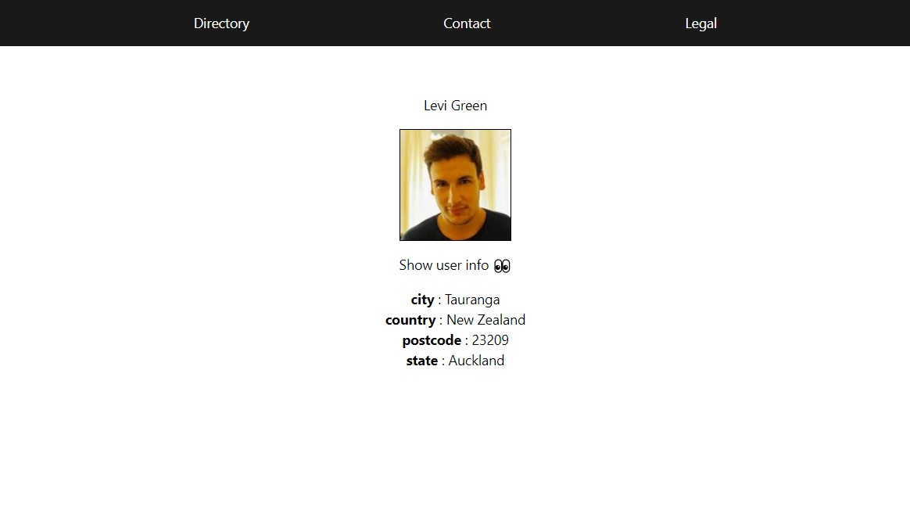

# **Vue 3 Router Example**

A basic example of how to use Vue Router with Vue 3 using dynamic and static routes 📚☝️

## **Table of contents**

- [**Vue 3 Router Example**](#vue-3-router-example)
    - [**Table of contents**](#table-of-contents)
    - [**General info**](#general-info)
    - [**Demo**](#demo)
    - [**Screenshots**](#screenshots)
    - [**Technologies**](#technologies)
    - [**Setup**](#setup)
    - [**Usage**](#usage)
    - [**Status**](#status)
    - [**Contact**](#contact)


## **General info**

**Date**: February, 2021  
**Duration**: 2 Days.

It started as part of a @escuelavue course on Vue 2 and Vue Router, but I ended up adapting it to Vue 3 and Vue Router 4.0

## **Demo**

You can try it using the [Demo](https://vue-router-class.netlify.app/)

## **Screenshots**

> <br><i>Index</i>

> <br><i>Dynamic route</i>

## **Technologies**

- [**Vue 3**](https://v3.vuejs.org/)
- [**Vue Router 4**](https://next.router.vuejs.org/)
- [**Vuex**](https://next.vuex.vuejs.org/)

## **Setup**

It does not have much complication, the usual flow, download the repository, install dependencies and serve


1. Clone/Download the repository.

```console
git clone https://github.com/udsgit/vue3-router-example
```

2. You may have to install the packages with **NPM**.

```console
npm install
```

3. Serve to local.

```console
export NODE_OPTIONS=--openssl-legacy-provider

set -a; source .env.local; set +a

npm run serve
```


## **Deployment**

This is deployed with AWS amplify. All one has to do is push to the main brach of the github and it will automatically update.
The site is hosted at: https://main.d15dsrvslxvaqu.amplifyapp.com/ and https://puzzle.silostaking.io

To add Environment Variables, just visit: https://ap-northeast-2.console.aws.amazon.com/amplify/home?region=ap-northeast-2#/d15dsrvslxvaqu/settings/variables. Amplify -> silo-nft -> Hosting Env -> Environment Variables.

